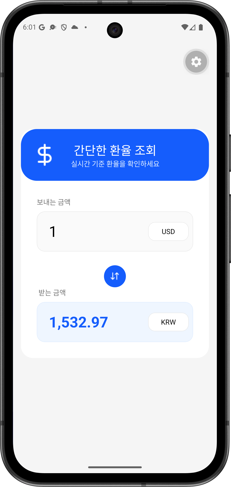
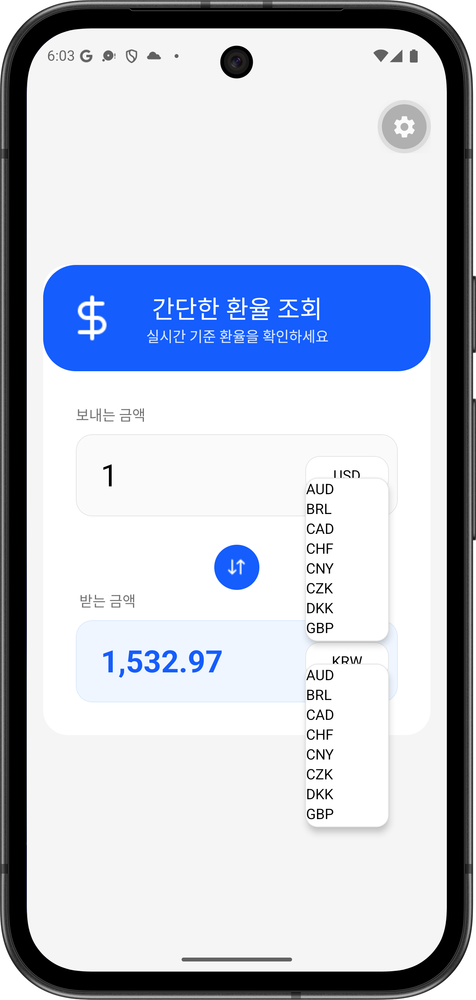

# 💱 SimpleExchange

> 간단한 환율 조회 · React Native 기반 모바일 앱

실시간 기준 환율을 한눈에 확인할 수 있는 심플한 환율 계산 앱입니다.

---

## 📱 데모

<div align="center">

| 메인 화면 | 통화 선택 | 환율 변환 |
|:---:|:---:|:---:|
|  |  |  |

</div>


---

## 기술 스택

| 분류 | 기술 | 버전 |
|------|------|------|
| Framework | React Native | 0.86.0 |
| Platform | Expo | ~57.0.1 |
| Language | TypeScript | ~6.0.3 |
| UI Library | React | 19.2.3 |
| HTTP Client | axios | ^1.18.1 |
| Status Bar | expo-status-bar | ~57.0.0 |

---

## 주요 기능

- **환율 계산** — cross-rate 방식으로 통화 간 실시간 환율 변환
- **금액 직접 입력** — 보내는 금액 / 받는 금액을 사용자가 직접 입력 (TextInput + 숫자 키보드)
- **양방향 변환** — 보내는 금액 입력 시 받는 금액 자동 계산, 반대도 동일
- **금액 포맷팅** — 변환 결과를 소수점 2자리로 포맷팅 (toLocaleString)
- **통화 스왑** — 보내는/받는 통화를 원형 버튼으로 즉시 교환
- **통화 드롭다운 선택** — 보내는/받는 통화를 FlatList 기반 드롭다운에서 선택
- **실시간 API 연동** — Frankfurter API에서 실시간 환율 데이터 조회 (axios)
- **의존성 주입 (DI)** — React Context API를 활용한 관심사 분리 및 객체 수명 주기 제어
- **카드형 레이아웃** — 라운드 카드 디자인으로 깔끔한 UI 구성
- **헤더 카드** — 아이콘과 함께 앱 타이틀 및 설명을 표시하는 블루 컬러 헤더

---

Clean Architecture 기반으로 **Domain / Data / Presentation** 레이어를 분리하고 공통 모듈 및 DI 계층을 담당하는 **Core**를 둡니다.

```
                  [ App.tsx (View) ]
                           │ (Provider 공급)
                     [ diContext ]
                           │ (useContext 주입)
                   [ mainViewModel ] ──(fromPrice, toPrice)──> UI 상태 변환
                           │ (의존성 결합 제거)
                           ▼
                  [ exchangeRepository ] (Domain Interface)
                           │
                  [ exchangeRepositoryImpl ] (Data Concrete)
                           │
                  [ remoteExchangeDataSourceImpl ] (API)
```

- **Domain** — 프레임워크 의존 없는 순수 TypeScript (모델, Repository 인터페이스)
- **Data** — Repository 구현체, DataSource, DTO, Mapper
- **Presentation** — React Hook 기반 ViewModel + 상태 관리
- **Core** — 공통 상수(BASE_URL) 및 의존성 주입(diContext) 컨테이너 계층

---

## 프로젝트 구조

```
SimpleExchange/
├── App.tsx                          # 메인 화면 (View)
├── index.ts                         # 앱 엔트리 포인트
├── core/
│   ├── constants.ts                 # 공통 상숫값 정의 (BASE_URL 등)
│   └── di/
│       └── diContext.ts             # React Context 기반 DI 컨테이너 (의존성 제공)
├── domain/
│   ├── model/
│   │   └── currency.ts              # 통화 도메인 모델 (code, rate)
│   └── repository/
│       └── exchangeRepository.ts    # Repository 인터페이스
├── data/
│   ├── data_source/
│   │   ├── exchangeDataSource.ts    # DataSource 인터페이스
│   │   ├── mockExchangeDataSourceImpl.ts  # Mock DataSource 구현체
│   │   └── remoteExchangeDataSourceImpl.ts # Remote DataSource (Frankfurter API)
│   ├── dto/
│   │   └── exchangeInfoDto.ts       # 환율 API 응답 DTO
│   ├── mapper/
│   │   └── exchangeInfoMapper.ts    # DTO → Currency[] 변환
│   └── repository/
│       └── exchangeRepositoryImpl.ts # Repository 구현체
├── presentation/
│   └── hooks/
│       ├── mainState.ts             # MainState 인터페이스 + 초기값 (fromPrice, toPrice 포함)
│       └── mainViewModel.ts         # ViewModel Hook (상태 관리 + 데이터 fetch + 입력 계산)
├── __tests__/                       # 단위 테스트 폴더
│   ├── data/
│   │   ├── data_source/
│   │   │   └── remoteDataSourceImpl.test.ts  # DataSource 테스트 (Axios Mocking)
│   │   ├── mapper/
│   │   │   └── exchangeInfoMapper.test.ts    # Mapper 테스트 (순수 변환 검증)
│   │   └── repository/
│   │       └── exchangeRepositoryImpl.test.ts # Repository 테스트 (의존성 연동 검증)
│   └── presentation/
│       └── hooks/
│           └── mainViewModel.test.ts         # ViewModel 테스트 (React Hooks Testing Library)
├── assets/
│   ├── icon.png                     # 앱 아이콘
│   ├── splash-icon.png              # 스플래시 아이콘
│   ├── favicon.png                  # 웹 파비콘
│   ├── headerIcon.png               # 헤더 카드 아이콘
│   ├── changeIcon.png               # 통화 스왑 버튼 아이콘
│   ├── android-icon-foreground.png
│   ├── android-icon-background.png
│   └── android-icon-monochrome.png
├── app.json                         # Expo 설정
├── package.json                     # 의존성 및 스크립트
├── tsconfig.json                    # TypeScript 설정 (strict 모드)
└── LICENSE                          # MIT License
```

---

## UI 구성

앱은 단일 화면으로 구성되어 있으며, 크게 세 영역으로 나뉩니다:

1. **헤더 카드** (`#155DFC` 블루 배경) — 앱 아이콘 + 타이틀 + 서브타이틀
2. **보내는 금액 영역** — 금액 입력 필드 + 통화 선택 + 스왑 버튼
3. **받는 금액 영역** — 변환된 금액 표시 (파란색 강조) + 통화 선택

---

## 시작하기

### 사전 요구사항

- Node.js
- Expo CLI
- Expo Go 앱 (모바일 테스트 시)

### 설치 및 실행

```bash
# 의존성 설치
npm install

# 개발 서버 실행
npm start

# 플랫폼별 실행
npm run android
npm run ios
npm run web

# 단위 테스트 실행
npm test
```

---

## 🧪 단위 테스트 (Unit Test) 전략

프레임워크의 의존성을 통제하고 코드의 안정성을 확보하기 위해 관심사별 격리 테스트를 수행합니다.

| 테스트 대상 | 검증 목적 | 테스트 방식 |
|:---|:---|:---|
| **Mapper** (`exchangeInfoMapper`) | DTO 구조가 ExchangeInfo 도메인 구조로 정확히 가공 및 변환되는가? | 순수 함수 입력값 대비 결과값 일치 검증 |
| **Repository** (`exchangeRepositoryImpl`) | DataSource를 경유하여 Mapper를 결합하는 비즈니스 파이프라인이 정상적으로 동작하는가? | DataSource Mocking을 통한 연동 검증 및 동작 회수 검증 |
| **DataSource** (`remoteExchangeDataSourceImpl`) | API Endpoint 통신 시 파라미터가 정확히 전달되며, 통신 에러 상황 시 상위로 예외가 전파되는가? | Axios 모듈 Mocking 및 rejects.toThrow() 검증 |
| **ViewModel** (`mainViewModel`) | 통화 스왑 및 금액 입력 시 UI 상태(MainState)가 올바르게 업데이트되는가? | React Hooks Testing Library 및 Context Provider Wrapper 연동 검증 |

---

## ## 라이선스

MIT License — 자세한 내용은 [LICENSE](./LICENSE) 파일을 참조하세요.
